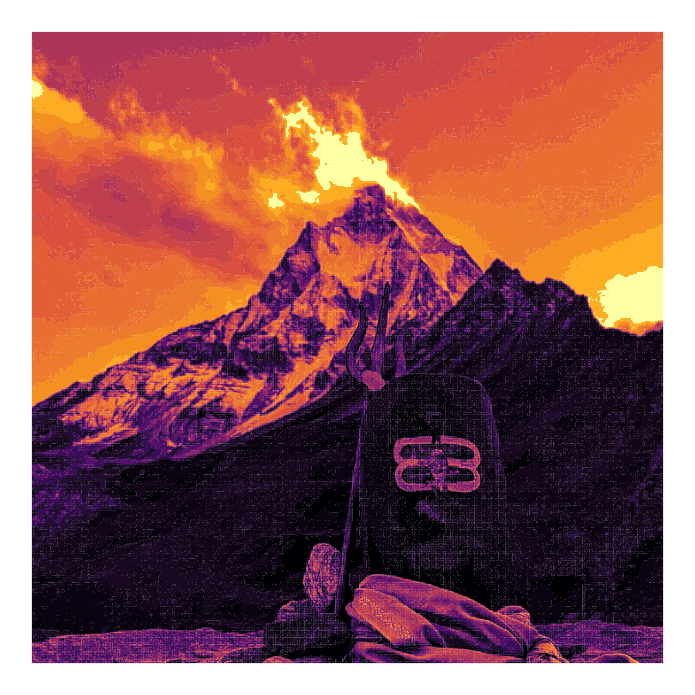

# Generative Art Using Images

This is a way for me to get closer to digital art which I am pssionate about. The following images seem basic for now but I am planning into generate art on a bigger scale!

## Orginal Image - Mt. Shivling

## Modified Image - Mt. Shivling

I am using R for implementing this and I am using the following person's work to get me started!

credits - https://github.com/cj-holmes/photos-on-spirals/tree/main
